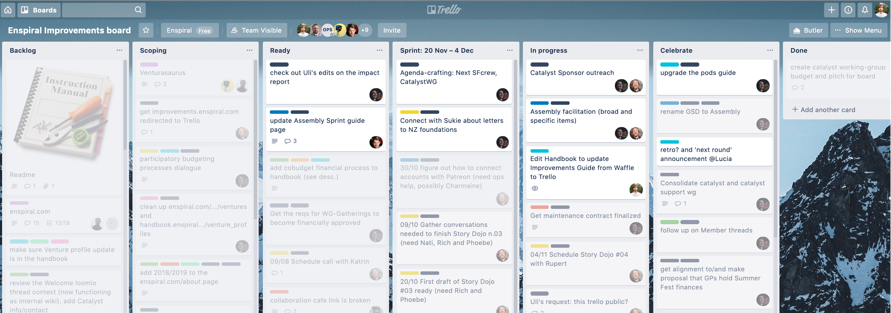

# Improvements

## When a problem comes along...

Usually, a problem or opportunity starts as a vague sense that something could be better. When this happens, you can start a conversation with other Enspiral people to see what they think. This could happen in our [digital communication spaces](https://github.com/enspiral/handbook/tree/d3234f4c1fe3afc87e5231beeb2d3926aee696d2/guides/guides/comms\_guidelines.md), in [Working Groups](https://github.com/enspiral/handbook/tree/d3234f4c1fe3afc87e5231beeb2d3926aee696d2/guides/guides/working\_groups.md) or at [Enspiral Retreats](https://github.com/enspiral/handbook/tree/d3234f4c1fe3afc87e5231beeb2d3926aee696d2/guides/guides/retreats.md).

Once we've had a discussion and got a clear understanding of what actions need to happen, then we use the Improvements board to track the work that is happening on Enspiral.

## The Improvements board

All Enspiral people can view the [Improvements board](https://trello.com/b/btHeb35m/enspiral-improvements-board). (If you can't access that link, send a quick email to foundation@enspiral.com.)

Here's what it looks like:

Here's what's going on:

* Each card represents a piece of work.
* The cards fade to gray when they are inactive. In the screenshot above you can see just a few active cards, with their white background.
* Cards are sorted into columns, and move from left to right: from "backlog" through to "in progress" and finally "done".
* Cards are labeled with coloured tags, each representing a different category of work.
* Press 'F' to find (search) cards. You can search by labels, for instance, here are [all the "help wanted" cards](https://trello.com/b/btHeb35m/enspiral-improvements-board?menu=filter\&filter=label:help%20wanted)
* The person responsble for the work is assigned to the card -- if you want to assign yourself to a job, on Trello you can hover your mouse over the card and then press 'space'.

## Improvement lifecycle

### Backlog

This is where an improvement starts. It could be a question, a problem or an idea to make things better. It could be a quick note or a lengthy treatise.

### Scoping

Occasionally a heroic individual will emerge from the fog and take responsibility for an improvement. An individual with the energy and vision to bring clarity to chaos, the wisdom to seek advice from their peers and the silvery tongue of a poet to make long sentences short.

They do not commit to doing the work but they do clarify and scope the improvement so that others can. Once everything is clear the scoper can gaze boldly towards the horizon, utter a meaningful "my work here is done", and stride off into the sunset. The ticket moves to Ready.

### Ready

Like a puppy locked up inside, the improvement languishes in the ready column just waiting for someone to come home and play with them. All they really want is to be outside running and jumping and rolling in the grass. Or some food, any food, but especially those sweet cobudget dollars.

But instead they are sitting here in a cold and dark concrete bunker. Alone and waiting for someone to love them, their big saucer eyes gazing falornely at all the strangers on the internet who give them the once over and think "not today".

Until that someone special arrives.

### In Progress

So much wow! Fireworks, magic, "oh my god this is really happening". Idea meets team. Documents are written, money moves, Loomio decisions fly and circles of hands raise towards the heavens with fingers sparkling. Ones turn to zeroes and zeroes turn to ones in their billions. People even talk to each other.

Until everyone gets a little bit tired and it's time for a nap and a serious discussion about how it all went.

### Celebrate

We share stories and learn from each other about what was, what could have been and what might be next time.

### Done

Well, that was all terribly exciting! An adventure that will be etched forever in the ticket's comment thread (or until the internet shuts down).

## Sprints

The [Catalysts](https://github.com/enspiral/handbook/tree/d3234f4c1fe3afc87e5231beeb2d3926aee696d2/guides/agreements/catalyst.md) maintain a 2-weekly rhythm to help coordinate the work. We call each 2-week period a "sprint". We look at the Improvement board at least once every sprint and make sure the cards are fresh. This means:

* We close issues in the Backlog that are older than three months with no activity
* We unassign and shift issues that have been in Scoping for more than a month to the Backlog
* We shift issues that have been in Ready for more than a month to the Backlog
* We prompt people assigned to In Progress issues for a status update. If you don't respond by the next sweep we move it to the Backlog
* We share stories from any Celebrate issues and move them to Done.&#x20;
* The Done column automatically consumes the card (nom nom nom) and adds the information to [this spreadsheet](https://docs.google.com/spreadsheets/u/2/d/1uX5vtcgtYHboO4Fxt0I2yAsedw6J0\_MPMSwmwSIhClk/edit#gid=0) so we can look back in future and see everrrrrything we've done.
